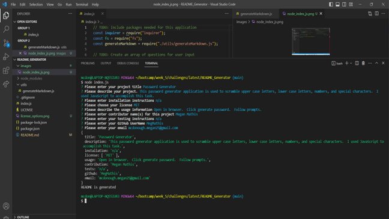

# Password Generator

## Description

This application is used so a user can quickly generate a README by entering in prompts.

## Table of Contents

- [Installation](#installation)
- [License](#license)
- [Usage](#usage)
- [ScreenShots](#screenshots)
- [Video](#video)
- [Links to Deployment](#linkstodeployment)
- [Credits](#LinkstoDeployment)
- [Contribution](#contribution)
- [Tests](#tests)
- [Questions](#questions)

## Installation

1. npm init
2. npm i iquirer

## License

MIT

## Usage

1. Run `node index.js`
2. Answer each prompt
3. License - use a drop down box to select your license.
4. Once finished you will be shown "README is generated"
5. Right click on README.md and click "Open in Preview"

## ScreenShots

## Video

https://drive.google.com/file/d/17jM0uItKU8YQe0Qj-IILgrHmRj2UILkV/view

## Links to Deployment

https://github.com/MegMathis/README_Generator

## Credits

https://www.markdownguide.org/cheat-sheet/

https://www.youtube.com/watch?v=QFV7jzu8mKw

https://www.youtube.com/watch?v=2VUQABoFOqw

https://www.digitalocean.com/community/tutorials/nodejs-interactive-command-line-prompts

https://shields.io/

https://gist.github.com/lukas-h/2a5d00690736b4c3a7ba

TA Paul

## Contribution

Megan Mathis

## Tests

n/a

## Questions

Any questions, please contact me at:

- GitHub:
  [MegMathis](http://github.com/MegMathis)
- Email:
  [mcdonough.megan25@gmail.com](mailto:mcdonough.megan25@gmail.com)
